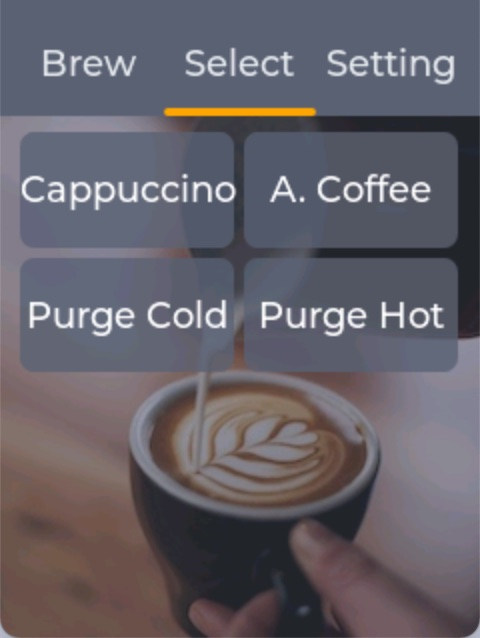
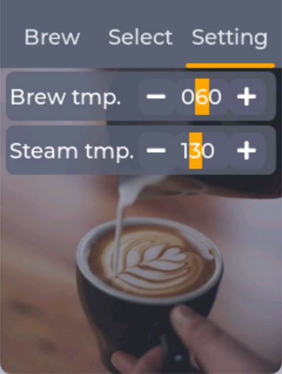
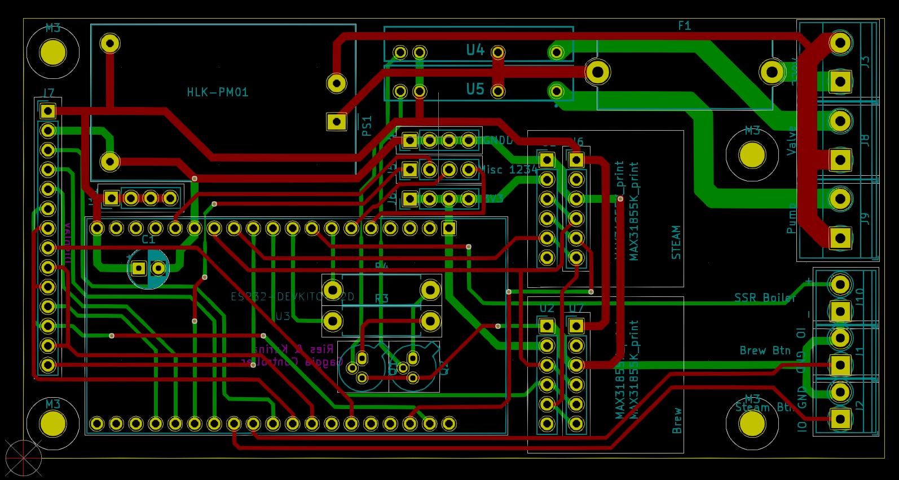

[](https://opensource.org/licenses/MIT)

# Design Goal
A make a gaggia coffee machine more smart and make it such that is would be easy to duplicate with least amouth of soldering.

Features
* Control temperature of both stream and brew and set temperature with a touch display (Fuzzy Logic)
* pre-infuse your coffee
* Make recipes using a simple scripting language with menu's controle brew/preinfuse timings and temperatures
* Standby + Remote turn on (Using MQTT and SIRI)
* Deep sleep option (work in progress)
* Stand by and power down options with a lower temperature to conserve energy.


# How it looks like...

 Main           |  Menu Screen | Settings Screen | Mounted on Gaggia
:-------------------------:|:-------------------------:|:-------------------------:|:-------------------------:
 |   |  |  

# Word Of Warning

### Please read this carefull!

If you are going to build this project you have to understand you will be working with dangerous voltages and high temperatures! Although I did my best to use standard components that I think are reliable, I cannot be held responsible for any damages to your machine, yourself or the surroundings in any way possible.

# Compilation

```bash
rvt$ pio run
Processing gaggia (platform: espressif32; framework: arduino; board: esp32dev)
-------------------------------------------------------------------------------------------------------------------------------------------------------------------------------------------------------------------------------------------------
Verbose mode can be enabled via `-v, --verbose` option
CONFIGURATION: https://docs.platformio.org/page/boards/espressif32/esp32dev.html
PLATFORM: Espressif 32 (2.1.0) > Espressif ESP32 Dev Module
...
...
...
|-- <WiFi> 1.0
Building in debug mode
Retrieving maximum program size .pio/build/gaggia/firmware.elf
Checking size .pio/build/gaggia/firmware.elf
Advanced Memory Usage is available via "PlatformIO Home > Project Inspect"
RAM:   [===       ]  25.6% (used 84048 bytes from 327680 bytes)
Flash: [=======   ]  72.6% (used 1427385 bytes from 1966080 bytes)
============== [SUCCESS] Took 4.41 seconds ==============
```

To upload to your esp32 device run the following command (OSX):

```
platformio run --target uploadfs -e gaggia
platformio run --target upload -e gaggia
```

To update over Over The Air (OTA):
```
platformio run --target uploadfs -e gaggia --upload-port <IP or DOmain name of device>
platformio run --target upload -e gaggia --upload-port <IP or DOmain name of device>
```


For other compiler options check `config.hpp` and `platformio.ini` for other options. 

# Configuration

The device will use the know wifi network or it wil present itself as a WIFI accesspoint using a wifimanager. Just connect to that accesspoint and open a browser to configure WIFI andf MQTT.
By default it will have some scripts to do some of it's work. Check the data directory that is almost self explanatory on how it works.

# Scripting

Well, it's not really scripting because the scripting capabilities are very limited, only simple jumps and no math. See it like more like a PLC function where you can make decissions, jump or wait at various points within the process and controle the state of the machine

| Command       | Type    | Values        | Explanation | Example |    |
| ------------- |:--      |:------------- |:-----       |:-----   |:-- | 
| jump          | String | label name | Jump to a specific label | `jump=foo;`<br>`skipThis=1;`<br>`label=foo;`| Jump to label `foo` skiping the line `skipThis` |
| label         | String | any string | A label jump can jump into      |   See Jump |
| valve | bool | 1 or 0 | Turn on the 3 way valve      | `valve=1;` | Turn on the 3 way valve |
| pump | bool | 1 or 0 | Turn on the pump      | `pump=1;` | Turn on the pump |
| brewMode | bool | 1 or 0 | Setup the controller to read brew sensor temperature. Otherwise read temperature from steam sensor | `brewMode=1;` | |
| brewTemp | float or valueRef | 0..160 or string | Set a desired temperature and enable brewMode, wait untill reached or above      | `brewTemp=95;`<br>`brewTemp=fromConfig;` | Set the brew temperature to 95 degrees. Or read the desired temperature from the `fromConfig` value in `gaggiaCfg.conf` |
| steamTemp | float or valueRef | 0..160 or string | Setup the controller to read steam sensor temperature. Otherwise read temperature from steam sensor | `steamTemp=150;` | |
| setTemp | float or valueRef | 0..160 or string | Set a desired temperature, similar to brewTemp but do not wait | `setTemp=95;`<br>`setTemp=fromConfig;` | |
| Message | String,String | | Shows a message box on the first screen | `Message=Message,Title;` | Display a message 'message' with title 'Title' |
| MessageOff | ignored | | Hide the message box | `MessageOff=1;` | Hode the message box | 
| load | String | any valid script filename | Load a new script | `load=/foo.txt;` | Load a new script with filename foo.txt, / is mandatory | 
| SteamButton | bool | 1 or 0 | Wait for the steam button to have a specific value | `SteamButton=1;` | Wait untill the steam button is pressed |
| BrewButton | bool | 1 or 0 | Wait for the brew button to have a specific value | `BrewButton=0;` | Wait untill the brew button is released |
| BrewOrSteamButton | bool,String,String,bool | 1 or 0,label,label,1 or 0 | Wait for the brew or steam button to have a specific value | `BrewOrSteamButton=1,jumpBrew,jumpSteam,1;` | Wait untill Brew or Steam is set (first bool is set or unset) jump to brew or steam, when non is set wait (0) or continue 1 |
| BrewAndSteamButton | bool | 1 or 0 | Wait for the brew and steam button to have a specific value | `BrewAndSteamButton=1;` | Wait untill the brew and steam button are in a pressed state |

### Example of the Cappuccino script

Note, current scripting version does not support of adding comments, but they are added in the below script for clarity

Explanation of `cappuccino.txt`

```
pump=0; # Turn of pump (if it was on)
valve=0; # Turn of valve (if it was on)
SteamButton=1,steamIsOff; # If the steam button was set, continue to next line, otherwhsie jump to the steamIsOff label
Message=Turn off Steam,Cappuccino; # If steam was on, display message asking to turn off
SteamButton=0; # Wait here untill the steam button is in the off position
label=steamIsOff; # label that is skipped, or can bu jumped onto
Message=Press brew to start,Cappuccino; # Displat message with title
BrewButton=1; # Wait untill the brew button is pressed
Message=Wait for brew temperature; # Show message taht it is waiting untill brew temperaure is reached
brewTemp=defaultBrewTemp; # Set brewmode and temperature from configuration and wait untill temperature is reached
Message=Preinfusing...; # Display pre-infusing message
valve=1; # Turn on valve
wait=100; # wait 100ms
pump=1; # Turn on pump
wait=2000; # Wait 2 second
pump=0; # Turn of Pump
wait=5000; # Wait 5 seconds
Message=Brewing; # Display brewing
pump=1; # Turn on pump again
wait=30000; #Wait 30 seconds
pump=0; # Turn off pump
wait=100; # Wait 100ms
valve=0; # Turn off valve
Message=Done; # Display done message
wait=2500; # Wait 2500ms
MessageOff=1; #Hide message box
```


#### Script Limitations:

* A script file can currently be a maximum of 768 bytes. (See platformio.ini)
* Every line must be ended with an ;
* Scripting is still under (slow) development, let me know if you use it and/or have ideas
* See `data` directory for full working examples

# MQTT Messages

Messages can be send as simple string (properties format) or as JSON.


```json
{
    "tempBrew":49.50,
    "tempSteam":50.00,
    "setPoint":10.00,
    "boiler":0.00,
    "brewBut":0,
    "steamBut":0,
    "pump":0,
    "valve":0
}
```

# Scripting

See data directory for examples (this is still work in progress, but it works right now well enough for me to beabke to publish, however they are subject to change.

# Hardware and Connection

Note: For latest component set check the KiCAD schematic.

* 1x ESP32 
* 2x Zero Crossing SSR 10Amp (DC-AC) https://nl.aliexpress.com/item/32706812752.html?spm=a2g0s.9042311.0.0.46b54c4dXPbjTF
* 1x Zero Crossing SSR 25AMP (DC-AC)  https://nl.aliexpress.com/item/32706812752.html?spm=a2g0s.9042311.0.0.46b54c4dXPbjTF
* 2x Probe M4 Type K temperature sensor  https://nl.aliexpress.com/item/32824035575.html?spm=a2g0s.9042311.0.0.46b54c4delJT6H
* 1x ILI9341 + Touch display 240x320 2.8" SPI TFT LCD Touch Panel https://nl.aliexpress.com/item/4000631140288.html?spm=a2g0s.9042311.0.0.46b54c4delJT6H
* 2x MAX31855K K Type Thermokoppel Breakout Board  https://nl.aliexpress.com/item/4000030496237.html?spm=a2g0o.cart.0.0.26e83c00vfImW6&mp=1
* Assorted silicon wires that can handle the current, like XXAWG for the heat element (for 230V Gaggia), the rest can be XXAWG 
* HLK-PM01 230 -> 5VDC power supply https://nl.aliexpress.com/item/32408565688.html?spm=a2g0s.9042311.0.0.13984c4dg0pb5v

note: For the MAX31855K make sure you get the 'fancy' one, that is proper dialectric consensator, NOT the one with just two components

# Connection diagram

For pins in `platformio.ini`

_WARNING schematic needs further verification_
See KIA Print for latest version.




# Hardware and functions Tested

- [x] TFT/Touch display (ILI9341)
- [x] Temperature sensors
- [x] Buttons
- [x] SSR
- [x] Temperature control
- [x] Scripting
- [x] Power save and powerdown


# Homebridge

JSON COnfiguration for homebrige so you can turn on and off the machine with SIRI.
`ID OF ESP32` is in the form of `XXXXXXXX`. Use a tool like http://mqtt-explorer.com to see the messages

```json
 {
            "accessory": "mqttthing",
            "type": "outlet",
            "name": "Gaggia",
            "url": "<MQTT URL>",
            "username": "<mqtt username>",
            "password": "<mqtt password>",
            "integerValue": true,
            "confirmationPeriodms": 250,
            "onlineValue": "online",
            "offlineValue": "offline",
            "retryLimit": 2,
            "topics": {
                "getOnline": "gaggia/<ID OF ESP32>/lastwill",
                "getOn": {
                    "topic": "gaggia/<ID OF ESP32>/status",
                    "apply": "var m=JSON.parse(message); return m.setPoint>40;"
                },
                "setOn": {
                    "topic": "gaggia/<ID OF ESP32>/config",
                    "apply": "return message==1?'on=1':'on=0';"
                }
            }
        }
```